# 用網頁把整個流程跑一遍

這份文件的讀者是**不寫程式的人**——營運、產品、業務,或是任何想先看懂這套系統在做什麼的人。

你會用滑鼠和鍵盤,在兩個網站上把一家交易所的完整生意跑一遍:開戶、入帳、掛單、成交、提現、人工審核、看錢離開錢包、對帳、查稽核紀錄。全部用點的。

裡面的錢是假的,鏈是假的,不會有任何真實資產移動。這是刻意的——這套系統在 v1 只連測試鏈,永遠不接主網。

需要的時間:第一次大約一小時,其中三十分鐘是電腦在下載東西。

---

## 1. 先說清楚:哪些事沒辦法只靠網頁

要誠實講在前面,免得你做到一半才發現。

**有三件事一定要在終端機打**(終端機就是那個黑底白字、只能打字的視窗):

1. 產生只屬於這台電腦的密鑰
2. 把整座交易所開起來
3. 拿後台的手機驗證碼密鑰

就這三件。做完之後**到收工為止,全部都在網頁上點**。

原因不是偷懶。第 1 件產生的是密碼與金鑰,放到網頁上輸入等於把它們經過瀏覽器,那是壞設計;第 2 件是啟動一台伺服器,那本來就不是網頁能做的事;第 3 件的密鑰**刻意只印一次**,不留在任何地方——這正是它安全的原因。

**還有一件事這份文件不做:從鏈上真的匯錢進來。** 那需要另一個終端機工具。主線改用後台的「手動調帳」把錢記進客戶帳戶——那是交易所員工每天都在用的真功能,不是為了教學造的捷徑。想看鏈上真的動,第 13 節有選配的作法。

---

## 2. 開機:終端機三行

如果這台電腦還沒跑過這個專案,先照 [新手 README](../../README.md) 的「第一次啟動」把專案抓下來。已經抓下來的話,在專案資料夾裡開終端機,打這三行:

**第一行——產生只屬於你的密鑰:**

```sh
make gen-dev-secrets
```

**你會看到:** 一串 `wrote ...` 的訊息,最後說 `.env` 建好了。這裡面有資料庫密碼、錢包密碼、後台管理員的初始密碼,每一台電腦都不一樣。

**第二行——把整座交易所開起來:**

```sh
make up-single
```

**你會看到:** 十幾行 `Container ... Started` / `Healthy`。第一次要下載映像檔,大約十到二十分鐘;之後每次兩分鐘內。

**第三行——拿後台的手機驗證碼密鑰:**

```sh
make totp-enroll EMAIL=admin@example.com
```

**你會看到:**

```
admin totp enroll: admin@example.com

  otpauth URL  otpauth://totp/...
  secret       XXXXXXXXXXXXXXXXXXXXXXXXXXXXXXXX
```

打開手機的驗證器 App(Google Authenticator、Microsoft Authenticator、1Password 都可以),選「手動輸入密鑰」,把 `secret` 後面那一串打進去。

> **這串密鑰只會顯示這一次。** 關掉終端機就再也看不到了。沒設定好就再跑一次這行指令換一組新的。

最後還要知道管理員的密碼。它在專案資料夾裡的 `.env` 檔案裡——**用記事本打開它**(Windows 的記事本、Mac 的文字編輯都可以),找到這一行:

```
ADMIN_BOOTSTRAP_PASSWORD=......
```

等號後面那一串就是。先抄下來。

**終端機的部分到此結束。** 接下來全部用瀏覽器。

---

## 3. 兩個網站,分別是誰在用

| 網址 | 這是什麼 | 誰在用 |
|---|---|---|
| <http://localhost:8088> | **交易前台** | 你的客戶。註冊、看行情、下單、充值提現 |
| <http://127.0.0.1:8082/admin/login> | **管理後台** | 交易所自己的員工。審核、調帳、對帳、查紀錄 |

兩個都可以在右上角切「中文 / EN」。以下用中文介面說明。

**它們是兩個完全分開的東西。** 客戶永遠碰不到後台;後台的員工也沒有客戶的密碼。後台甚至**拿不到金庫的鑰匙**——它只能看和批准,真正簽名送錢的是另一個程式。

---

## 4. 開一個客戶帳號

瀏覽器開 <http://localhost:8088>。

**你會看到:** 市場列表,只有一列 `ETH-USDC`——用 USDC(一種跟美元 1:1 的穩定幣)買賣 ETH(以太幣)。最新價那一欄是 `—`,因為還沒有任何人成交過。

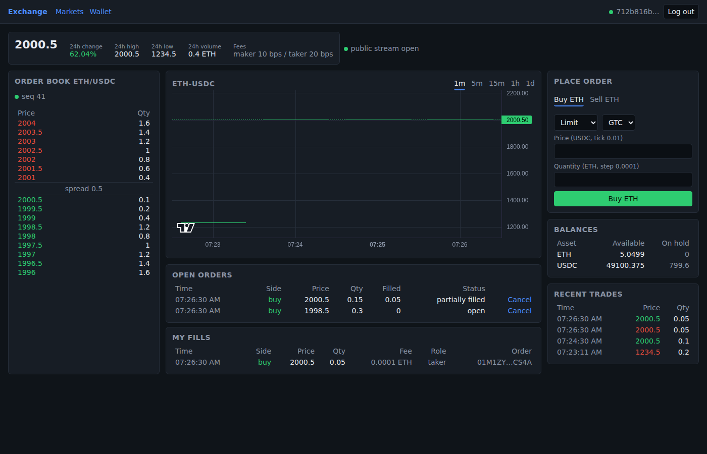

按右上角的**註冊**:

- 電子郵件:`alice@example.com`
- 密碼:隨便打至少 8 個字元

按**建立帳號**。

**你會看到:** 回到市場頁,右上角多了一個綠點(代表這個帳號的私人推播已經連上)、帳戶 ID 的前 8 碼,以及一個**錢包**連結。

> 這裡的電子郵件不會寄信、不會驗證,只是帳號的名字。

按上方的**錢包**。

**你會看到:** 最上面一行「帳戶 ID」後面是一串很長的字。**把它整串複製下來**,等一下後台要用。下面是餘額(現在全是 0)、充值紀錄、提現紀錄,再下面是「充值」和「提現」兩張表單。

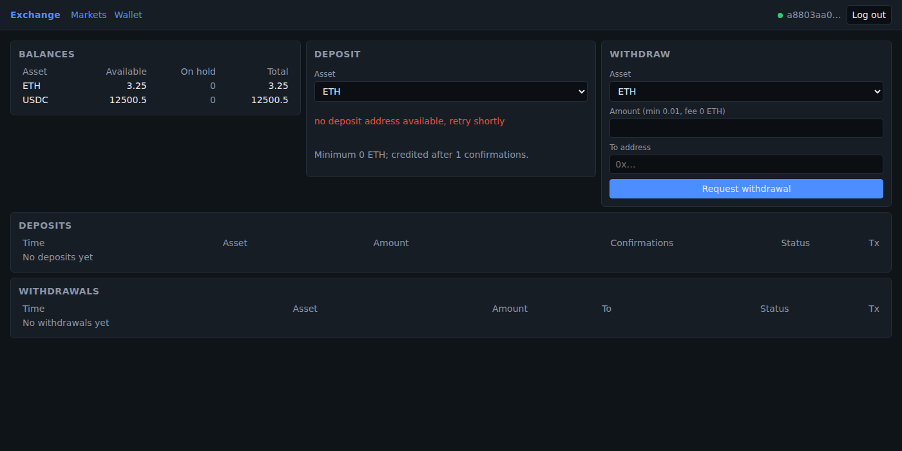

---

## 5. 第一次進後台

瀏覽器開 <http://127.0.0.1:8082/admin/login>。

- 電子郵件:`admin@example.com`
- 密碼:剛剛從 `.env` 抄下來的那一串

按**繼續**。

**你會看到:** 一個要求輸入六位數字的頁面。打開手機的驗證器 App,把 `admin@example.com` 那一組現在顯示的六位數輸進去,按**驗證**。

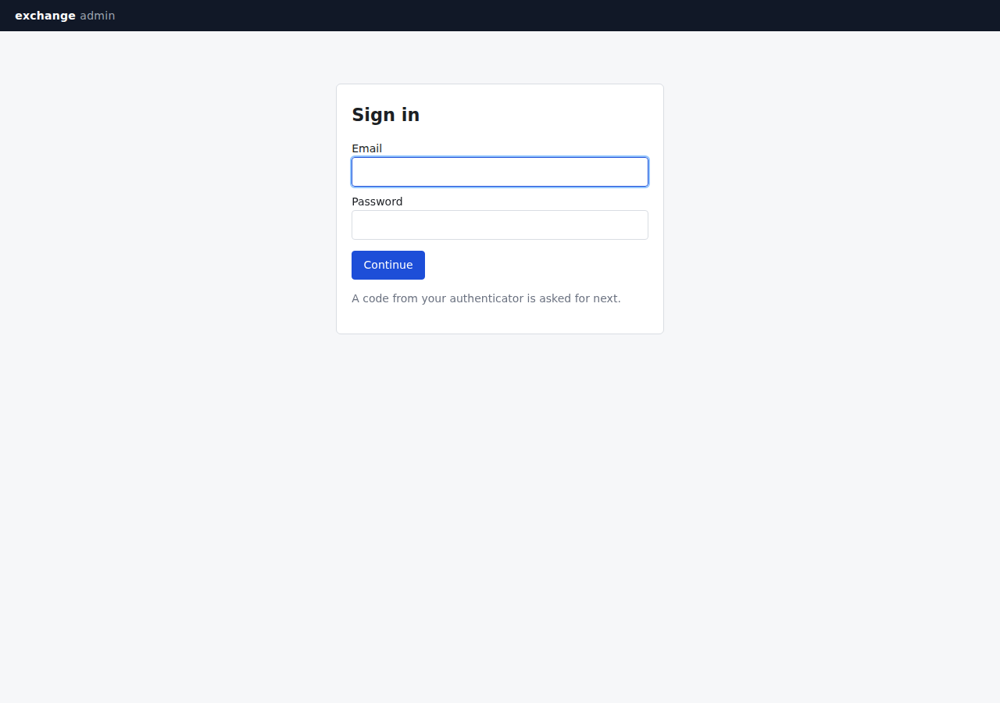 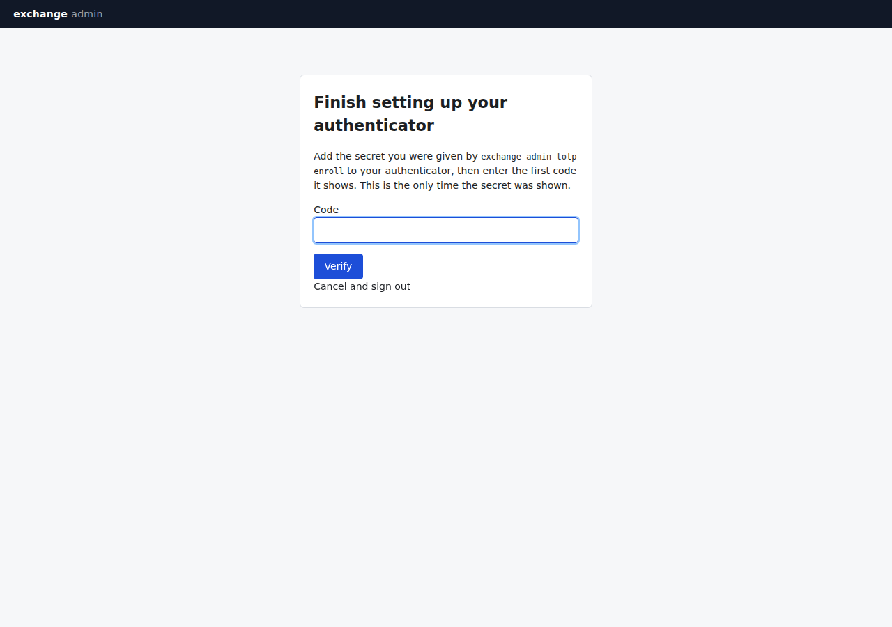

> **為什麼後台要兩道關卡?** 因為後台可以改別人的錢。密碼會外洩、會被猜到、會被重複使用;手機上那組每三十秒換一次的數字不會。真實交易所的後台被攻破,通常不是撬開金庫,是有人拿到了員工的密碼。

**你會看到儀表板:**

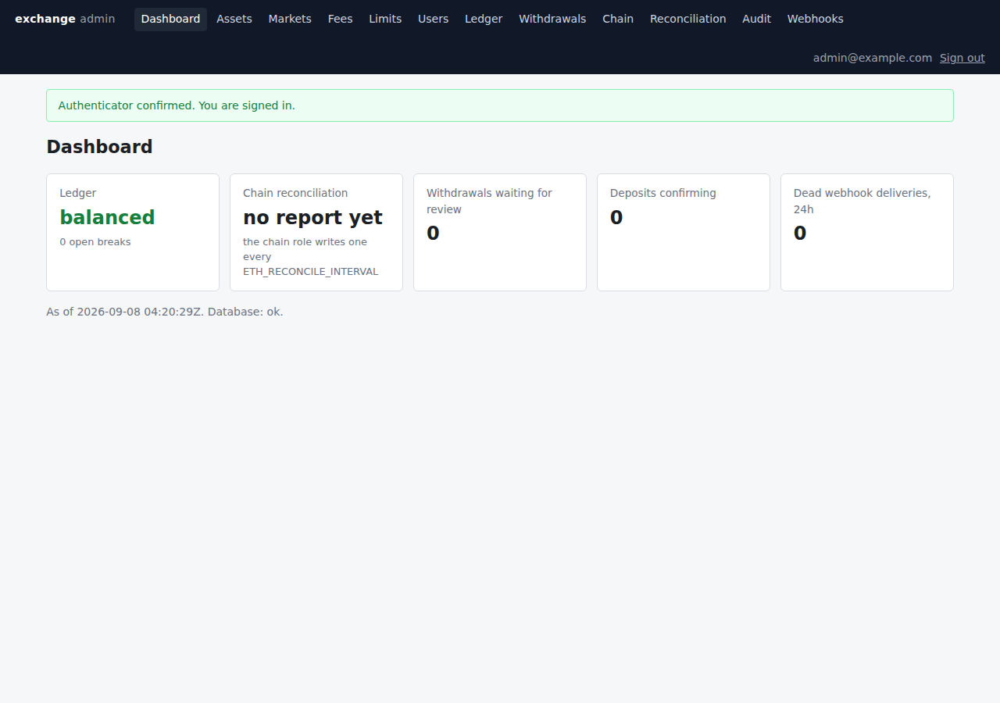

六塊磚,每一塊都可以點進去:

- **帳本:平衡**(綠色)、`0 筆未結差異` —— 所有人的錢加起來,借方和貸方相等
- **鏈上對帳:有差異**(紅色) —— **這是正常的,而且是刻意的**。假區塊鏈一開機就直接塞了 100 顆 ETH 進交易所的熱錢包,帳本上沒有任何一筆記錄它。對帳程式每隔幾秒把「帳本以為有多少」跟「鏈上真的有多少」比一次,發現鏈上比較多就報出來。真實交易所裡這代表要有人去查錢從哪來;在這裡它證明**對帳真的在看**
- **待審核的提現:0**
- **確認中的充值:0**
- **24 小時內放棄的 webhook 投遞:0**
- **最近一次備份:尚無**

---

## 6. 給客戶錢:後台的手動調帳

新帳號的餘額是零。真實交易所裡,錢是客戶從鏈上匯進來的;但**每一家交易所的後台都有手動調帳這個功能**——補償、退款、活動送幣、修正錯帳都要用它。我們就用它。

後台左邊選**用戶**。

**你會看到:** 用戶列表,裡面有 `alice@example.com`。

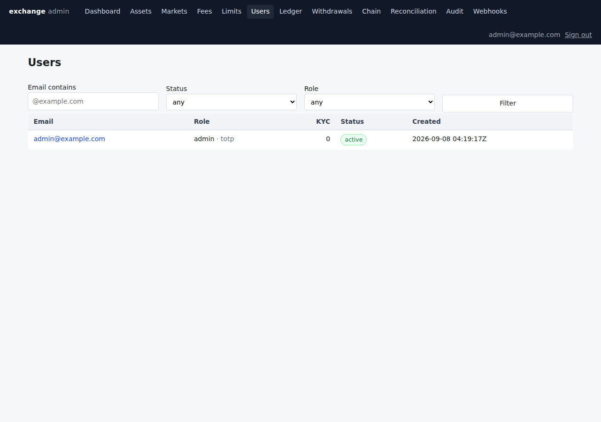

點 `alice@example.com` 進去。

**你會看到:** 她的 KYC 等級(現在是 0)、狀態、以及一行**現貨帳戶**,後面是一個連結。點它。

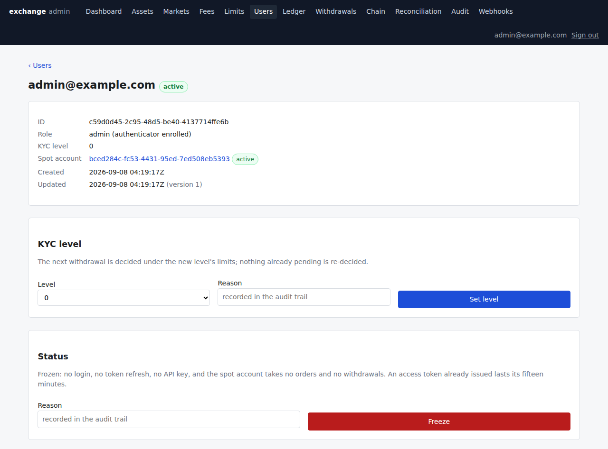

**你會看到帳本頁**,而且已經自動填好 alice 的帳戶。頁面上有:

- **試算表** —— 每個資產的借方總額、貸方總額、差額。差額全是 0 就是**平衡**
- **內部帳戶** —— 交易所自己的科目:手續費收入、託管中的資產、gas 支出……
- **這個帳戶的分錄** —— 現在是空的
- 最下面:**手動調帳**

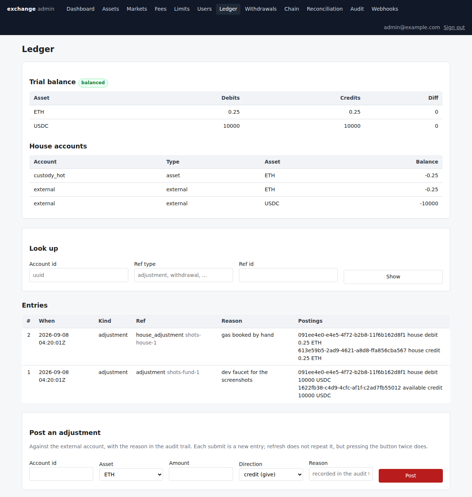

在**手動調帳**那張表單裡填:

| 欄位 | 填什麼 |
|---|---|
| 帳戶 ID | alice 的(頁面上通常已經帶好了;沒有的話貼上第 4 節複製的那一串) |
| 資產 | `USDC` |
| 金額 | `10000` |
| 方向 | **貸方(給錢)** |
| 原因 | `demo funding` |

按送出。

**你會看到:** 頁面上方一條綠色訊息「調帳已入帳,分錄編號 ...」,下方的分錄多了一列。

**再做一次,這次給她 ETH:** 資產 `ETH`、金額 `1`、方向**貸方(給錢)**、原因 `demo funding`。

> **「貸方(給錢)」是什麼意思?** 這是複式記帳:每一筆錢都同時記在兩個地方,而且金額相等。給 alice 10000 USDC,系統其實記了兩行——從「外部」這個科目借 10000,貸到 alice 的可用餘額 10000。兩邊相等,所以試算表永遠平衡。**這個專案裡每一塊錢都是這樣進出的**,不會有一邊沒對到的錢。表單上那句提示也講了同一件事:「對方是外部帳戶,原因會記錄在審計紀錄。」
>
> 另外注意提示的後半句:「每按一次送出就是一筆新分錄;重新整理不會重複,但按兩次會。」網頁沒辦法像程式那樣帶一個防重複的識別碼,所以**不要連按兩次**。

**現在切回前台 alice 的分頁。不用重新整理。**

**你會看到:** 錢包頁的餘額直接變成 USDC 可用 `10000`、ETH 可用 `1`。

這是行情推播在工作:後端記完帳,馬上把變動推到你的畫面。客戶不用按 F5。

---

## 7. 掛一張買單

在 alice 的分頁回到**市場**,點 `ETH-USDC` 那一列進交易頁。

右邊是**下單**。填:

1. 確認選的是**買入 ETH**、類型**限價**
2. 價格 `2000`
3. 數量 `0.5`

按綠色的**買入 ETH**。

**你會看到:**

- 下單表格下面一行綠字:「掛單中 · 成交量 0」
- 左邊**訂單簿**的買方多了一列 `2000 / 0.5`
- 下方**未成交訂單**多了一列
- 右邊**餘額**:USDC 可用 `9000`、**凍結** `1000`

> **「凍結」是什麼?** 你答應用 2000 買 0.5 顆,總共要付 1000 USDC。這筆錢還在你帳上,但被鎖住了,不能拿去做別的事。要是你可以一邊掛單一邊把錢領走,成交的時候就付不出來——凍結就是防這件事。成交或撤單之後,凍結才解開。

價格和數量都有限制:價格必須是 `0.01` 的整數倍,數量必須是 `0.0001` 的整數倍,而且成交金額至少 5 USDC。填錯了表單會當場擋下來並告訴你為什麼。

---

## 8. 當自己的對手,看它成交

一個人買不成交,要有人賣。

開一個**新的瀏覽器分頁**(新分頁沒有登入狀態),一樣到 <http://localhost:8088>,註冊第二個帳號 `bob@example.com`。到 bob 的錢包頁複製他的帳戶 ID。

回到後台,重複第 6 節:**用戶** → `bob@example.com` → **現貨帳戶** → 手動調帳,給他 `ETH` `1`,方向**貸方(給錢)**。

回到 bob 的分頁,進 `ETH-USDC` 交易頁:選**賣出 ETH**、限價、價格 `2000`、數量 `0.2`,按紅色的**賣出 ETH**。

**bob 會看到:** 「全部成交 · 成交量 0.2」。餘額變成 ETH `0.8`、USDC `399.2`。

**切回 alice 的分頁,你會看到:**

- 未成交訂單那一列變成「部分成交」,已成交 `0.2`
- **我的成交**多了一列:2000 × 0.2,角色是**掛單方**
- 餘額:ETH `1.1998`、USDC 可用 `9000`、凍結 `600`
- 訂單簿買方那一列變成 `2000 / 0.3`
- **最近成交**多了一筆

> **為什麼數字不是整數?** 交易所收**手續費**。
>
> alice 是**掛單方**(先把單子掛在簿上、提供流動性的人),費率 0.1%:0.2 × 0.1% = 0.0002 ETH,所以她拿到 0.1998 而不是 0.2。
> bob 是**吃單方**(來吃掉別人掛單的人),費率 0.2%:400 × 0.2% = 0.8 USDC,所以他拿到 399.2 而不是 400。
>
> 成交價永遠用**掛單方**的價格。alice 凍結的 1000 裡用掉了 400,剩下 600 繼續凍結,等剩下的 0.3 顆。
>
> 這兩筆手續費去哪了?回後台的**帳本**頁,在內部帳戶裡看得到手續費收入的餘額變了。

想收掉剩下的:在 alice 的未成交訂單那一列按**撤單**,訂單簿那一列消失,凍結歸零。

---

## 9. 提現(一):金額在額度內,自動放行

在 alice 的分頁按上方的**錢包**,捲到最下面的**提現**表單:

| 欄位 | 填什麼 |
|---|---|
| 資產 | `ETH` |
| 金額 | `0.05` |
| 收款地址 | `0x000000000000000000000000000000000000dead` |

按**送出提現申請**。

> **關於那個地址:** 它是這條假鏈上一個沒有人持有私鑰的地址,錢送過去就拿不回來了——真實提現就是這樣,送出去就是別人的。**請整串用小寫**:系統會檢查大小寫混合的地址是不是符合以太坊的checksum 規則(那個大小寫其實是一組防打錯的檢查碼),全小寫則直接放行。

**你會看到:** 表單上方一行綠字「提現 xxxxxxxx **自動核准**」,提現紀錄多了一列。狀態會自己往前走(必要時重新整理一次),依序是 **已核准 → 資金已鎖定 → 已簽章 → 已廣播 → 已確認**,最後那一欄出現一個交易編號。

**它沒有經過任何人。** 因為 0.05 ETH 在自動核准的額度內。

現在回後台看**提現**頁。

**你會看到:** 「沒有等待中的提現。**自動核准額度內的提現不會出現在這裡。**」

這是刻意的設計:小額提現如果每一筆都要人看,營運會被淹沒,而且人看久了就會變成無腦按核准——那比不看還糟。

---

## 10. 提現(二):金額超過額度,進人工審核

再送一次,這次金額填 `0.3`,地址一樣。

**你會看到:** 綠字變成「提現 xxxxxxxx **待人工審核**」,而且狀態就**停在那裡不動了**。

回後台的**提現**頁。

**你會看到:** 「等待審核」底下多了一列,五個欄位:申請時間(底下是這筆提現的編號,可以點)、帳戶(可以點進帳本看這個人的每一筆分錄)、金額、收款地址,以及最後一欄**決定**——一個備註欄加上「核准」和「拒絕」兩個按鈕。

> **這一頁不會告訴你「為什麼」它在這裡。** 這是目前的一個小缺口:系統知道原因(超過自動核准額度),但沒有把它顯示在這一列上。要判斷合不合理,你得自己對照下面那張額度表。

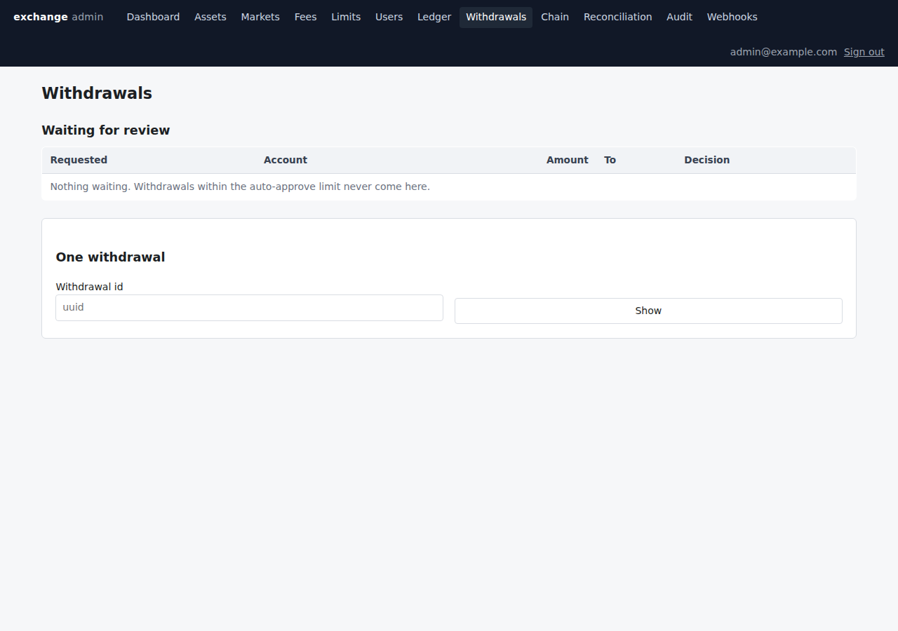

**額度是誰決定的?** 後台左邊的**提現限額**頁。

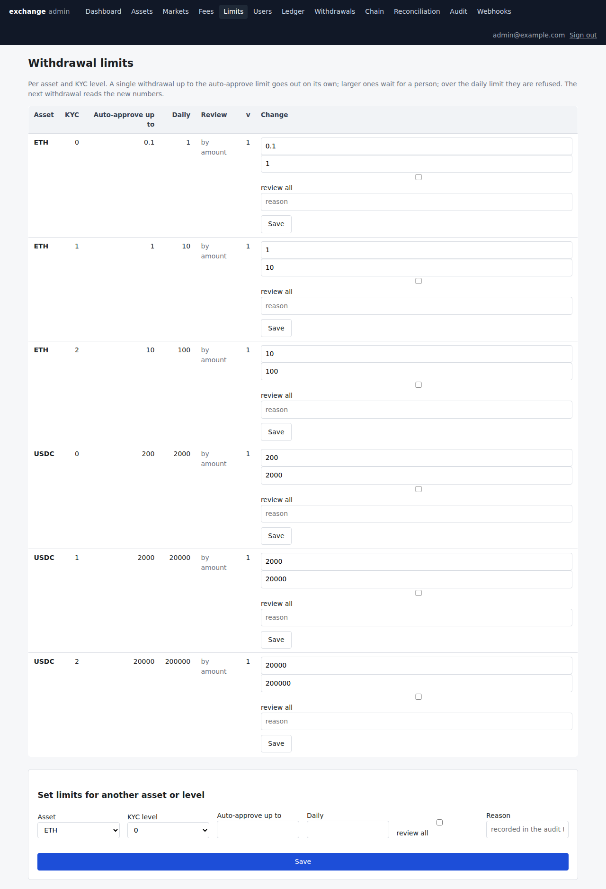

**你會看到**一張表,每個資產 × 每個 KYC 等級一列:

| 資產 | KYC 等級 | 自動核准額度 | 每日額度 |
|---|---|---|---|
| ETH | 0 | 0.1 | 1 |
| ETH | 1 | 1 | 10 |
| ETH | 2 | 10 | 100 |
| USDC | 0 | 200 | 2000 |
| USDC | 1 | 2000 | 20000 |
| USDC | 2 | 20000 | 200000 |

alice 是 KYC 等級 0,所以單筆超過 0.1 ETH 就要人看。這張表在頁面上**改得動**——這就是營運調整風險胃納的地方。

> **一個值得記住的設計:超過額度的處理是「送人工審核」,不是「拒絕」。**
>
> 額度是「**誰來決定**」的門檻,不是「這筆提現不合法」的判斷。人可以核准例外。系統只在三種情況直接拒絕:帳戶被凍結、這個資產關閉提現、金額低於最小提現額。

在那一列填備註 `demo`,按**核准**。

**你會看到:** 綠字說這筆的狀態變了,那一列從等待審核消失。切回 alice 的分頁,狀態一路跑到**已確認**。

想試拒絕的話:**拒絕必須填備註**,不填會被擋下來——因為被拒絕的客戶一定會問為什麼,而那個答案必須當場寫下來,不能事後補。

---

## 11. 看錢真的離開錢包

後台左邊的**鏈上**。

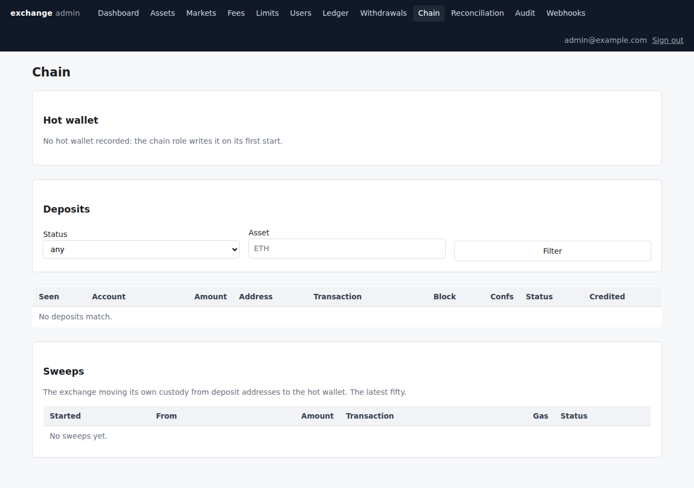

**你會看到:**

- **熱錢包** —— 交易所對外付錢的那個地址、它的餘額、下一個 nonce(交易序號),以及有沒有低於警戒線
- **帳本持有** —— 帳本認為託管在熱錢包裡的金額
- **充值** —— 掃描到的入帳,以及各自的確認數
- **歸集** —— 交易所把自己託管的資產從各個充值地址搬回熱錢包的紀錄

剛剛那兩筆提現,錢就是從**熱錢包**出去的。你可以看到它的餘額少了 0.35 ETH 再多一點(多的那一點是 gas,鏈上的手續費,由交易所吸收)。

> **簽名是誰做的?** 不是後台。整座系統裡只有一個角色拿得到金鑰,而且它**沒有對外的門**——後台送出的是一個「意圖」(提現 #123,第 0 次嘗試,送 X 給 Y),那個角色自己組交易、自己簽,而且同一個意圖只能被簽一次。後台就算被攻破,也只能製造意圖,不能自己簽一筆出去。

---

## 12. 對帳:交易所怎麼知道自己沒算錯

後台左邊的**對帳**。

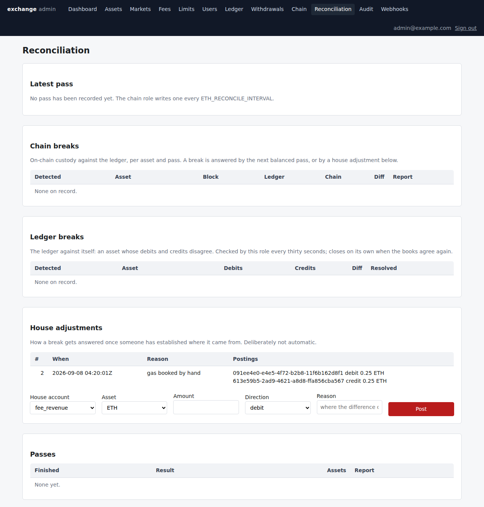

**你會看到:**

- **最近一次對帳** —— 每個資產一列,四個數字並排:帳本說有多少、鏈上真的有多少、還沒入帳的、在途的
- **鏈上差異** —— 對不起來的紀錄
- **帳本差異** —— 帳本自己對自己:某個資產的借方和貸方不相等(這種在正常情況下永遠不該出現)
- **內部調帳** —— 查清楚差異來源之後,用這裡處理

那筆一開機就有的 100 ETH 差異會在這裡列著。頁面上的提示寫得很清楚:「差異由下一次平衡的對帳自動關閉,或由下方的內部調帳處理。」而且「**刻意不做自動化**」——自動抹平差異等於自動掩蓋問題。

> **這一頁抓過真的東西。** 對帳上線第一天就抓到一個撐過了整套自動測試的漏洞:交易所墊給充值地址的手續費,被當成使用者的充值入帳了。修完之後那個情境就永遠留在測試裡。

---

## 13. 審計:你剛剛做的每一件事都留下來了

後台左邊的**審計**。

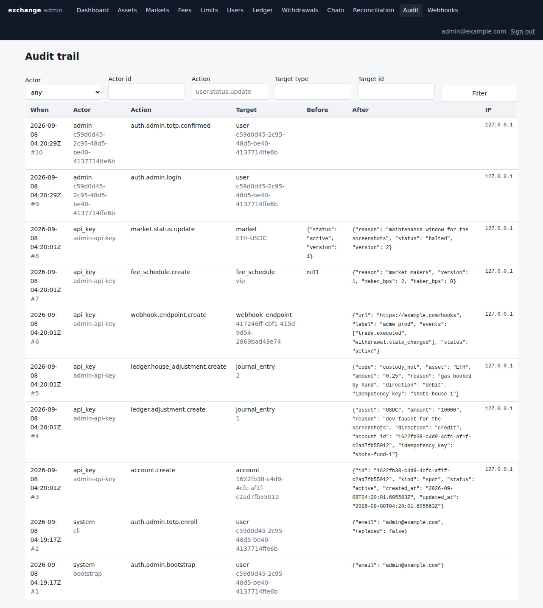

**你會看到**一串紀錄,而且裡面應該有你這一小時做的每一件事:

- 你的後台登入
- 兩筆(或三筆)手動調帳,連原因都在
- 那筆提現的核准,連備註都在

可以用操作者、對象類型、對象 ID 篩選。**這些紀錄刪不掉。** 後台做的每一件會動到錢或動到別人帳號的事,都會在同一筆資料庫交易裡寫進這裡——記帳成功而稽核沒寫成功,這件事在設計上不可能發生。

---

## 14. 其他你會用到的後台頁面

| 頁面 | 在這裡做什麼 |
|---|---|
| **資產** | 新增一種幣、改它的合約地址與小數位、要幾個確認才入帳、最小充值提現金額、暫停某個幣的充值或提現 |
| **市場** | 新增交易對、改最小跳動價與最小下單量、把市場設成暫停或只准撤單 |
| **手續費** | 改掛單方 / 吃單方的費率。**改完立刻生效**,在途的訂單用舊的 |
| **Webhook** | 設定要把事件推去哪個網址、看每一次投遞的結果、重送失敗的 |

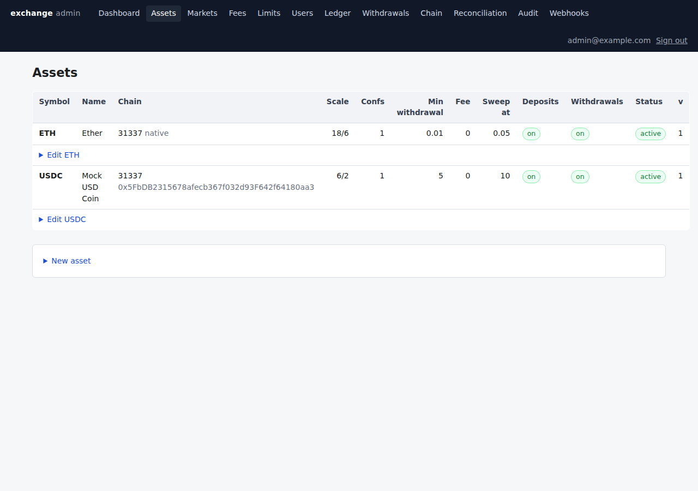 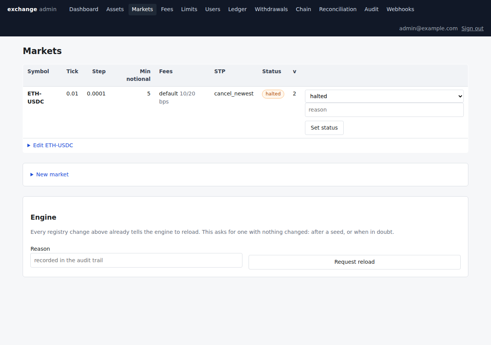

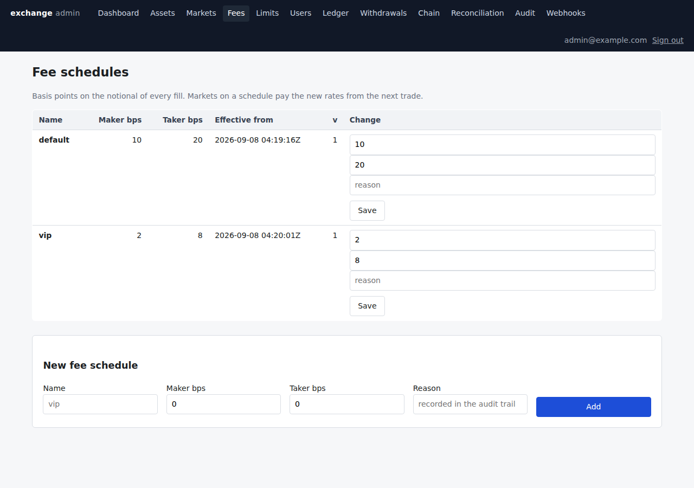 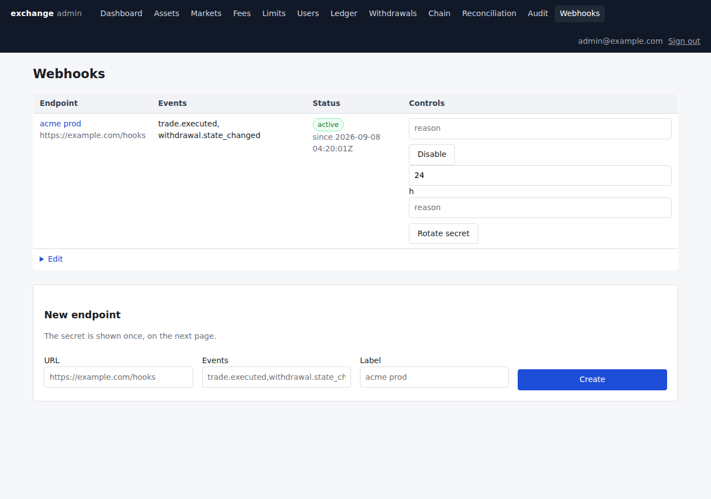

**新增一種幣完全不用改程式**:在資產頁按新增、填合約地址與小數位、按儲存,交易引擎自己重新載入,掃描器下一輪就開始盯著它。

---

## 15. 選配:真的從鏈上充值

主線刻意用手動調帳入帳,因為那是純網頁的。想看鏈上真的動的話,這一段需要回終端機用一個叫 `cast` 的工具,步驟寫在 [Sepolia 實跑指南](sepolia.md)。

流程是這樣:客戶在錢包頁按**充值**、選幣種,系統給他一個**只屬於他的地址**;他把幣轉到那個地址;掃描器每幾秒去鏈上看一次,看到就先記成「看到了」(**這時還不是錢**),等確認數夠了才真的記帳(**這一刻才是錢**)。你在後台的**鏈上**頁可以看到它從確認中變成已入帳。

---

## 16. 收工

回終端機:

```sh
make down
```

資料都還在。下次 `make up-single` 兩分鐘內回來,帳號、餘額、訂單、紀錄全部都在。

想從頭來過、清掉所有資料:

```sh
make reset
```

---

## 17. 出了問題?

| 症狀 | 原因 | 怎麼辦 |
|---|---|---|
| 網頁打不開 | 交易所還在啟動 | 等一分鐘再試。還是不行的話終端機打 `make ps` 看有沒有服務不是 healthy |
| 後台密碼說錯誤 | 抄錯,或 `.env` 被重新產生過 | 重新用記事本打開 `.env`,重抄 `ADMIN_BOOTSTRAP_PASSWORD` |
| 六位數字說錯誤 | 手機時間跟電腦差太多 | 手機的時間設成自動。還是不行就重跑 `make totp-enroll` 換一組 |
| 手動調帳說找不到帳戶 | 帳戶 ID 沒複製完整 | 回前台錢包頁,把整串重新複製一次 |
| 下單被擋 | 價格或數量不是最小單位的整數倍,或成交金額低於 5 USDC | 照表單上的提示調整 |
| 提現說地址無效 | 地址打錯,或大小寫混合但檢查碼不對 | 整串改成小寫再送一次 |
| 提現卡在「等待審核」 | 這是正常的 | 去後台的**提現**頁核准它(第 10 節) |
| 儀表板的「鏈上對帳」是紅的 | 正常,而且是刻意的 | 見第 5 節的說明 |
| 某個 port 被佔用 | 電腦上別的程式在用 | 這個專案用 5432、6379、4222、8545、8080、8081、8082、8088、3000、9090、16686 |

---

## 18. 名詞小抄

| 詞 | 白話 |
|---|---|
| **訂單簿** | 所有還沒成交的買單和賣單排成的表。買的出價由高到低,賣的要價由低到高 |
| **限價單** | 「我最多出這個價」。沒人接受就掛在簿上等 |
| **市價單** | 「多少錢我都買」。立刻成交,但價格不保證 |
| **掛單方 / 吃單方** | 先把單掛上去等的是掛單方(費率低,因為他提供了流動性);來吃掉別人掛單的是吃單方(費率高) |
| **凍結** | 錢還是你的,但被鎖住不能動用,等成交或撤單 |
| **複式記帳** | 每一筆錢同時記在兩個地方且金額相等,所以帳永遠對得起來 |
| **試算表** | 把所有科目的借方和貸方加總比一次。差額是 0 就是平衡 |
| **KYC 等級** | 客戶身分驗證到什麼程度。等級越高,能自動提現的額度越大 |
| **熱錢包** | 交易所對外付錢用的地址,金鑰在線上。相對的是冷錢包,金鑰離線 |
| **歸集** | 把散在各個客戶充值地址上的錢,收回熱錢包集中管理 |
| **對帳** | 把「帳本以為有多少」和「鏈上真的有多少」比一次 |
| **gas** | 在區塊鏈上做任何事都要付的手續費,付給礦工/驗證者,不是付給交易所 |
| **nonce** | 一個地址發出的交易序號,必須連號。跳號的話後面的交易會卡住 |
| **稽核紀錄** | 誰在什麼時候做了什麼的流水帳,刪不掉 |
| **TOTP** | 手機驗證器上每三十秒換一次的六位數字 |

---

## 接下來可以看什麼

- **[系統總覽](../system-overview.md)** —— 這套系統的架構、錢怎麼跑、CI/CD 全綠代表什麼、未來怎麼擴充。同樣不需要會寫程式
- **[新手 README](../../README.md)** —— 跟這份重疊但更短,而且第 7、8 步是用指令而不是網頁
- **[工程師版 README](../README.md)** —— 想動程式的話從這裡開始
